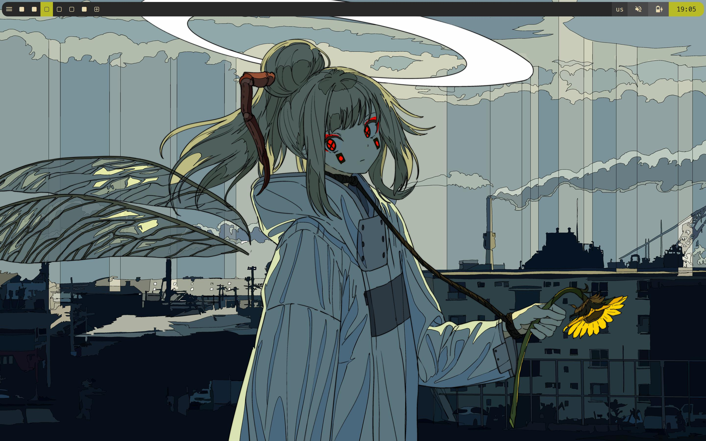

# DWM

version 6.4

---

## Patches
- alttagsdecoration
- barpadding
- center
- centeredwindowname
- fullgaps
- pertag
- selfrestart
- resizecorners
- status2d
- statusbutton
- statuscmd-nosignal
- statuscolors
- statuspadding
- systray
- xresources
